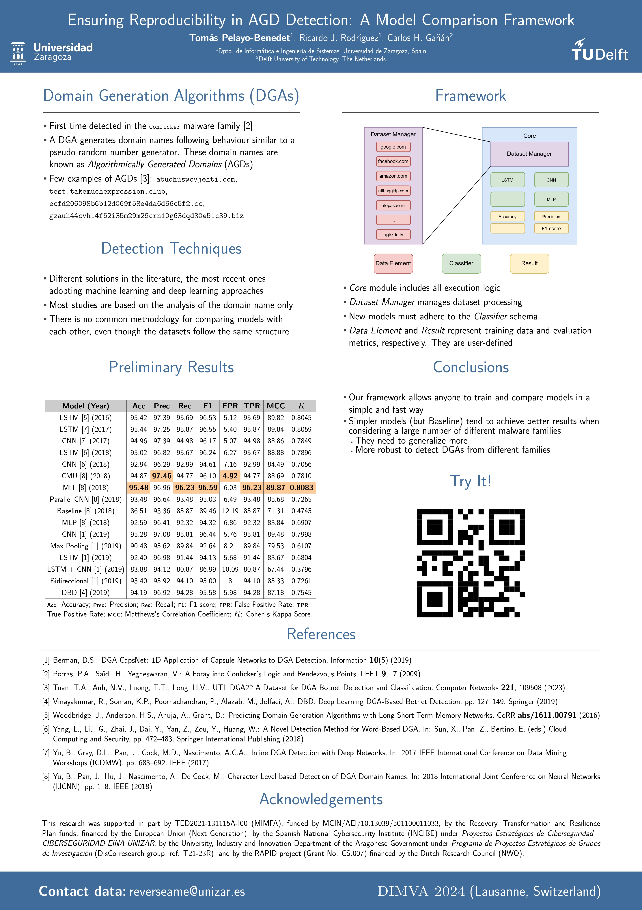

## DIMVA'24: Ensuring Reproducibility in AGD Detection: A Model Comparison Framework

  

    

      
    

    

      
<strong>Description:</strong> This poster presents a framework for ensuring reproducibility in AGD detection by comparing different models. It highlights key findings and methodologies used in the study.

      <a href="../assets/posters/pdf/dimva24.pdf" download class="btn" target="_blank">Download in PDF</a>
    

  

